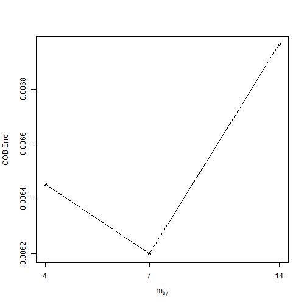
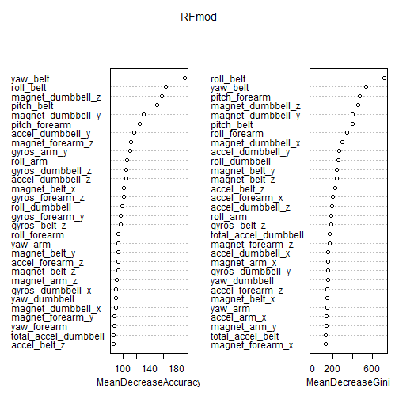

#HAC-Exercise Data set Activity recognition Analysis

---
title: "Human Activity recognition dataset analysis"
author: "Abhishek Singh"
date: "Saturday, June 18, 2016"
---


```r
library(caret)
library(randomForest)
library(gbm)
library(knitr)
```
  
##Acquiring the Data  
  
The credit for this data is to : Ugulino, W.; Cardador, D.; Vega, K.; Velloso, E.; Milidiu, R.; Fuks, H. Wearable Computing: Accelerometers' Data Classification of Body Postures and Movements. Proceedings of 21st Brazilian Symposium on Artificial Intelligence. Advances in Artificial Intelligence - SBIA 2012. In: Lecture Notes in Computer Science. , pp. 52-61. Curitiba, PR: Springer Berlin / Heidelberg, 2012. ISBN 978-3-642-34458-9. DOI: 10.1007/978-3-642-34459-6_6. 

As the data sets are small, I load them directly into memory from the URLs

```r
trainAdd<-"https://d396qusza40orc.cloudfront.net/predmachlearn/pml-training.csv"
testAdd<-"https://d396qusza40orc.cloudfront.net/predmachlearn/pml-testing.csv"

training1 <- read.csv(url(trainAdd), na.strings=c(" ","NA","#DIV/0!","","-"))
Validation <- read.csv(url(testAdd), na.strings=c(" ","NA","#DIV/0!","","-"))
```
  
##Creating Required DataSets  
  
Sub-Dividing the data set to create a testing set for estimating the Out of Sample Error.

```r
Sub1<-createDataPartition(training1$classe,p=0.6,list=FALSE)
training<-training1[Sub1,]
test<-training1[-Sub1,]
rm(Sub1)
```
   
##Preprocessing  
  
Looking at the summary for a sense of the data distribution and missing values.

```r
summary(training)
```

```
##        X            user_name    raw_timestamp_part_1 raw_timestamp_part_2
##  Min.   :    5   adelmo  :2307   Min.   :1.322e+09    Min.   :   301      
##  1st Qu.: 4922   carlitos:1861   1st Qu.:1.323e+09    1st Qu.:254682      
##  Median : 9854   charles :2153   Median :1.323e+09    Median :496308      
##  Mean   : 9825   eurico  :1842   Mean   :1.323e+09    Mean   :501298      
##  3rd Qu.:14724   jeremy  :2040   3rd Qu.:1.323e+09    3rd Qu.:752298      
##  Max.   :19620   pedro   :1573   Max.   :1.323e+09    Max.   :998801      
##                                                                           
##           cvtd_timestamp new_window    num_window      roll_belt     
##  05/12/2011 11:24: 890   no :11537   Min.   :  1.0   Min.   :-28.80  
##  28/11/2011 14:14: 884   yes:  239   1st Qu.:223.0   1st Qu.:  1.09  
##  30/11/2011 17:11: 874               Median :427.0   Median :114.00  
##  05/12/2011 11:25: 863               Mean   :433.2   Mean   : 64.44  
##  02/12/2011 14:58: 855               3rd Qu.:651.0   3rd Qu.:123.00  
##  02/12/2011 14:57: 838               Max.   :864.0   Max.   :162.00  
##  (Other)         :6572                                               
##    pitch_belt          yaw_belt        total_accel_belt kurtosis_roll_belt
##  Min.   :-55.8000   Min.   :-180.000   Min.   : 0.00    Min.   :-2.121    
##  1st Qu.:  1.8900   1st Qu.: -88.300   1st Qu.: 3.00    1st Qu.:-1.349    
##  Median :  5.3000   Median : -13.100   Median :17.00    Median :-0.849    
##  Mean   :  0.4807   Mean   : -11.692   Mean   :11.31    Mean   :-0.032    
##  3rd Qu.: 15.2000   3rd Qu.:   8.992   3rd Qu.:18.00    3rd Qu.:-0.174    
##  Max.   : 60.3000   Max.   : 179.000   Max.   :29.00    Max.   :33.000    
##                                                         NA's   :11542     
##  kurtosis_picth_belt kurtosis_yaw_belt skewness_roll_belt
##  Min.   :-2.092      Mode:logical      Min.   :-5.745    
##  1st Qu.:-1.111      NA's:11776        1st Qu.:-0.515    
##  Median : 0.030                        Median : 0.004    
##  Mean   : 5.148                        Mean   :-0.078    
##  3rd Qu.: 3.609                        3rd Qu.: 0.416    
##  Max.   :58.000                        Max.   : 3.595    
##  NA's   :11561                         NA's   :11541     
##  skewness_roll_belt.1 skewness_yaw_belt max_roll_belt    max_picth_belt 
##  Min.   :-7.616       Mode:logical      Min.   :-94.30   Min.   : 3.00  
##  1st Qu.:-1.118       NA's:11776        1st Qu.:-88.10   1st Qu.: 5.00  
##  Median : 0.021                         Median : -9.70   Median :18.00  
##  Mean   :-0.166                         Mean   :-12.41   Mean   :12.63  
##  3rd Qu.: 0.901                         3rd Qu.:  4.05   3rd Qu.:19.00  
##  Max.   : 7.348                         Max.   :174.00   Max.   :30.00  
##  NA's   :11561                          NA's   :11537    NA's   :11537  
##   max_yaw_belt    min_roll_belt    min_pitch_belt   min_yaw_belt   
##  Min.   :-2.100   Min.   :-96.40   Min.   : 0.00   Min.   :-2.100  
##  1st Qu.:-1.300   1st Qu.:-88.40   1st Qu.: 3.00   1st Qu.:-1.300  
##  Median :-0.850   Median :-11.50   Median :16.00   Median :-0.850  
##  Mean   :-0.031   Mean   :-14.28   Mean   :10.53   Mean   :-0.031  
##  3rd Qu.:-0.200   3rd Qu.:  2.40   3rd Qu.:17.00   3rd Qu.:-0.200  
##  Max.   :33.000   Max.   :173.00   Max.   :23.00   Max.   :33.000  
##  NA's   :11542    NA's   :11537    NA's   :11537   NA's   :11542   
##  amplitude_roll_belt amplitude_pitch_belt amplitude_yaw_belt
##  Min.   : 0.000      Min.   : 0.000       Min.   :0         
##  1st Qu.: 0.300      1st Qu.: 1.000       1st Qu.:0         
##  Median : 0.990      Median : 1.000       Median :0         
##  Mean   : 1.868      Mean   : 2.096       Mean   :0         
##  3rd Qu.: 2.000      3rd Qu.: 2.000       3rd Qu.:0         
##  Max.   :27.860      Max.   :12.000       Max.   :0         
##  NA's   :11537       NA's   :11537        NA's   :11542     
##  var_total_accel_belt avg_roll_belt    stddev_roll_belt var_roll_belt    
##  Min.   : 0.000       Min.   :-27.40   Min.   : 0.000   Min.   :  0.000  
##  1st Qu.: 0.100       1st Qu.:  1.10   1st Qu.: 0.200   1st Qu.:  0.000  
##  Median : 0.200       Median :115.00   Median : 0.400   Median :  0.100  
##  Mean   : 0.884       Mean   : 65.29   Mean   : 1.267   Mean   :  7.562  
##  3rd Qu.: 0.300       3rd Qu.:123.20   3rd Qu.: 0.700   3rd Qu.:  0.400  
##  Max.   :16.500       Max.   :152.80   Max.   :14.200   Max.   :200.700  
##  NA's   :11537        NA's   :11537    NA's   :11537    NA's   :11537    
##  avg_pitch_belt    stddev_pitch_belt var_pitch_belt   avg_yaw_belt   
##  Min.   :-45.300   Min.   :0.000     Min.   :0.000   Min.   :-94.40  
##  1st Qu.:  2.750   1st Qu.:0.200     1st Qu.:0.000   1st Qu.:-88.25  
##  Median :  5.600   Median :0.300     Median :0.100   Median :-10.20  
##  Mean   :  1.835   Mean   :0.563     Mean   :0.659   Mean   :-13.30  
##  3rd Qu.: 15.900   3rd Qu.:0.700     3rd Qu.:0.500   3rd Qu.:  3.05  
##  Max.   : 59.700   Max.   :3.100     Max.   :9.500   Max.   :173.50  
##  NA's   :11537     NA's   :11537     NA's   :11537   NA's   :11537   
##  stddev_yaw_belt  var_yaw_belt     gyros_belt_x        gyros_belt_y     
##  Min.   :0.0     Min.   : 0.000   Min.   :-1.040000   Min.   :-0.53000  
##  1st Qu.:0.1     1st Qu.: 0.010   1st Qu.:-0.030000   1st Qu.: 0.00000  
##  Median :0.3     Median : 0.070   Median : 0.030000   Median : 0.02000  
##  Mean   :0.6     Mean   : 1.318   Mean   :-0.005945   Mean   : 0.03955  
##  3rd Qu.:0.6     3rd Qu.: 0.350   3rd Qu.: 0.110000   3rd Qu.: 0.11000  
##  Max.   :8.7     Max.   :75.920   Max.   : 2.200000   Max.   : 0.56000  
##  NA's   :11537   NA's   :11537                                          
##   gyros_belt_z      accel_belt_x      accel_belt_y     accel_belt_z    
##  Min.   :-1.4600   Min.   :-83.000   Min.   :-41.00   Min.   :-275.00  
##  1st Qu.:-0.2000   1st Qu.:-21.000   1st Qu.:  3.00   1st Qu.:-162.00  
##  Median :-0.1000   Median :-15.000   Median : 35.00   Median :-152.00  
##  Mean   :-0.1316   Mean   : -5.803   Mean   : 30.21   Mean   : -72.68  
##  3rd Qu.:-0.0200   3rd Qu.: -5.000   3rd Qu.: 61.00   3rd Qu.:  27.00  
##  Max.   : 1.6100   Max.   : 85.000   Max.   :150.00   Max.   : 104.00  
##                                                                        
##  magnet_belt_x    magnet_belt_y   magnet_belt_z       roll_arm      
##  Min.   :-52.00   Min.   :354.0   Min.   :-623.0   Min.   :-180.00  
##  1st Qu.:  9.00   1st Qu.:582.0   1st Qu.:-375.0   1st Qu.: -32.20  
##  Median : 34.00   Median :601.0   Median :-320.0   Median :   0.00  
##  Mean   : 55.26   Mean   :593.7   Mean   :-345.1   Mean   :  17.89  
##  3rd Qu.: 59.00   3rd Qu.:610.0   3rd Qu.:-306.0   3rd Qu.:  77.20  
##  Max.   :485.00   Max.   :669.0   Max.   : 289.0   Max.   : 179.00  
##                                                                     
##    pitch_arm          yaw_arm          total_accel_arm var_accel_arm   
##  Min.   :-88.200   Min.   :-180.0000   Min.   : 1.00   Min.   :  0.00  
##  1st Qu.:-26.100   1st Qu.: -42.7000   1st Qu.:17.00   1st Qu.: 10.99  
##  Median :  0.000   Median :   0.0000   Median :27.00   Median : 40.48  
##  Mean   : -4.781   Mean   :  -0.1037   Mean   :25.55   Mean   : 53.59  
##  3rd Qu.: 11.100   3rd Qu.:  45.8000   3rd Qu.:33.00   3rd Qu.: 75.80  
##  Max.   : 88.500   Max.   : 180.0000   Max.   :66.00   Max.   :331.70  
##                                                        NA's   :11537   
##   avg_roll_arm     stddev_roll_arm    var_roll_arm       avg_pitch_arm    
##  Min.   :-166.67   Min.   :  0.000   Min.   :    0.000   Min.   :-81.773  
##  1st Qu.: -37.54   1st Qu.:  1.605   1st Qu.:    2.577   1st Qu.:-24.078  
##  Median :   0.00   Median :  6.233   Median :   38.855   Median :  0.000  
##  Mean   :  14.07   Mean   : 12.001   Mean   :  437.885   Mean   : -4.971  
##  3rd Qu.:  79.38   3rd Qu.: 17.600   3rd Qu.:  309.756   3rd Qu.:  8.548  
##  Max.   : 160.78   Max.   :161.964   Max.   :26232.208   Max.   : 75.659  
##  NA's   :11537     NA's   :11537     NA's   :11537       NA's   :11537    
##  stddev_pitch_arm var_pitch_arm       avg_yaw_arm       stddev_yaw_arm   
##  Min.   : 0.000   Min.   :   0.000   Min.   :-173.440   Min.   :  0.000  
##  1st Qu.: 1.737   1st Qu.:   3.018   1st Qu.: -29.307   1st Qu.:  4.129  
##  Median : 8.521   Median :  72.616   Median :   0.000   Median : 17.878  
##  Mean   :10.230   Mean   : 186.983   Mean   :   2.004   Mean   : 24.000  
##  3rd Qu.:15.081   3rd Qu.: 227.431   3rd Qu.:  35.590   3rd Qu.: 36.993  
##  Max.   :43.412   Max.   :1884.565   Max.   : 152.000   Max.   :177.044  
##  NA's   :11537    NA's   :11537      NA's   :11537      NA's   :11537    
##   var_yaw_arm        gyros_arm_x        gyros_arm_y       gyros_arm_z     
##  Min.   :    0.00   Min.   :-6.37000   Min.   :-3.4400   Min.   :-2.1700  
##  1st Qu.:   17.08   1st Qu.:-1.36000   1st Qu.:-0.7900   1st Qu.:-0.0700  
##  Median :  319.61   Median : 0.06000   Median :-0.2400   Median : 0.2300  
##  Mean   : 1200.38   Mean   : 0.02567   Mean   :-0.2502   Mean   : 0.2725  
##  3rd Qu.: 1368.47   3rd Qu.: 1.56000   3rd Qu.: 0.1600   3rd Qu.: 0.7200  
##  Max.   :31344.57   Max.   : 4.87000   Max.   : 2.7900   Max.   : 2.9900  
##  NA's   :11537                                                            
##   accel_arm_x       accel_arm_y       accel_arm_z       magnet_arm_x   
##  Min.   :-404.00   Min.   :-318.00   Min.   :-636.00   Min.   :-580.0  
##  1st Qu.:-241.25   1st Qu.: -54.00   1st Qu.:-145.00   1st Qu.:-299.0  
##  Median : -44.00   Median :  13.00   Median : -48.00   Median : 292.0  
##  Mean   : -59.45   Mean   :  32.07   Mean   : -71.64   Mean   : 192.9  
##  3rd Qu.:  85.00   3rd Qu.: 138.00   3rd Qu.:  24.00   3rd Qu.: 639.0  
##  Max.   : 431.00   Max.   : 308.00   Max.   : 271.00   Max.   : 780.0  
##                                                                        
##   magnet_arm_y     magnet_arm_z    kurtosis_roll_arm kurtosis_picth_arm
##  Min.   :-392.0   Min.   :-597.0   Min.   :-1.809    Min.   :-2.084    
##  1st Qu.: -13.0   1st Qu.: 126.0   1st Qu.:-1.335    1st Qu.:-1.273    
##  Median : 203.0   Median : 441.0   Median :-0.858    Median :-0.996    
##  Mean   : 155.7   Mean   : 304.8   Mean   :-0.484    Mean   :-0.675    
##  3rd Qu.: 322.0   3rd Qu.: 545.0   3rd Qu.: 0.016    3rd Qu.:-0.389    
##  Max.   : 582.0   Max.   : 693.0   Max.   : 6.210    Max.   : 6.398    
##                                    NA's   :11582     NA's   :11584     
##  kurtosis_yaw_arm skewness_roll_arm skewness_pitch_arm skewness_yaw_arm
##  Min.   :-2.098   Min.   :-2.541    Min.   :-2.065     Min.   :-6.000  
##  1st Qu.:-1.244   1st Qu.:-0.499    1st Qu.:-0.629     1st Qu.:-0.684  
##  Median :-0.735   Median : 0.062    Median :-0.124     Median :-0.108  
##  Mean   : 0.361   Mean   : 0.086    Mean   :-0.078     Mean   :-0.128  
##  3rd Qu.: 0.079   3rd Qu.: 0.701    3rd Qu.: 0.451     3rd Qu.: 0.345  
##  Max.   :56.000   Max.   : 2.094    Max.   : 2.655     Max.   : 7.483  
##  NA's   :11542    NA's   :11581     NA's   :11584      NA's   :11542   
##   max_roll_arm   max_picth_arm      max_yaw_arm     min_roll_arm   
##  Min.   :-73.1   Min.   :-173.00   Min.   : 4.00   Min.   :-89.10  
##  1st Qu.: -1.2   1st Qu.:  -1.80   1st Qu.:29.00   1st Qu.:-41.75  
##  Median :  4.7   Median :  31.10   Median :35.00   Median :-22.00  
##  Mean   : 11.1   Mean   :  37.26   Mean   :35.62   Mean   :-20.78  
##  3rd Qu.: 26.0   3rd Qu.: 100.00   3rd Qu.:42.00   3rd Qu.:  0.00  
##  Max.   : 85.5   Max.   : 180.00   Max.   :62.00   Max.   : 66.40  
##  NA's   :11537   NA's   :11537     NA's   :11537   NA's   :11537   
##  min_pitch_arm      min_yaw_arm    amplitude_roll_arm amplitude_pitch_arm
##  Min.   :-180.00   Min.   : 1.00   Min.   :  0.00     Min.   :  0.00     
##  1st Qu.: -71.20   1st Qu.: 8.00   1st Qu.:  8.75     1st Qu.: 14.60     
##  Median : -38.50   Median :12.00   Median : 28.40     Median : 60.50     
##  Mean   : -36.77   Mean   :14.63   Mean   : 31.87     Mean   : 74.04     
##  3rd Qu.:   0.00   3rd Qu.:19.00   3rd Qu.: 47.45     3rd Qu.:119.55     
##  Max.   : 152.00   Max.   :38.00   Max.   :118.00     Max.   :360.00     
##  NA's   :11537     NA's   :11537   NA's   :11537      NA's   :11537      
##  amplitude_yaw_arm roll_dumbbell     pitch_dumbbell     yaw_dumbbell     
##  Min.   : 0.00     Min.   :-153.71   Min.   :-148.50   Min.   :-150.871  
##  1st Qu.:13.00     1st Qu.: -19.24   1st Qu.: -41.13   1st Qu.: -77.521  
##  Median :22.00     Median :  47.87   Median : -21.30   Median :   0.000  
##  Mean   :20.98     Mean   :  23.59   Mean   : -10.87   Mean   :   2.302  
##  3rd Qu.:29.00     3rd Qu.:  67.67   3rd Qu.:  17.47   3rd Qu.:  80.623  
##  Max.   :52.00     Max.   : 151.35   Max.   : 129.82   Max.   : 154.754  
##  NA's   :11537                                                           
##  kurtosis_roll_dumbbell kurtosis_picth_dumbbell kurtosis_yaw_dumbbell
##  Min.   :-2.174         Min.   :-2.174          Mode:logical         
##  1st Qu.:-0.724         1st Qu.:-0.803          NA's:11776           
##  Median :-0.096         Median :-0.211                               
##  Mean   : 0.262         Mean   : 0.066                               
##  3rd Qu.: 0.894         3rd Qu.: 0.642                               
##  Max.   : 7.563         Max.   :11.950                               
##  NA's   :11539          NA's   :11538                                
##  skewness_roll_dumbbell skewness_pitch_dumbbell skewness_yaw_dumbbell
##  Min.   :-2.611         Min.   :-2.905          Mode:logical         
##  1st Qu.:-0.521         1st Qu.:-0.515          NA's:11776           
##  Median :-0.004         Median : 0.015                               
##  Mean   :-0.053         Mean   :-0.001                               
##  3rd Qu.: 0.481         3rd Qu.: 0.530                               
##  Max.   : 1.926         Max.   : 2.546                               
##  NA's   :11538          NA's   :11537                                
##  max_roll_dumbbell max_picth_dumbbell max_yaw_dumbbell min_roll_dumbbell
##  Min.   :-70.10    Min.   :-112.90    Min.   :-2.200   Min.   :-134.70  
##  1st Qu.:-26.50    1st Qu.: -62.80    1st Qu.:-0.700   1st Qu.: -59.45  
##  Median : 19.50    Median :  52.80    Median :-0.100   Median : -44.00  
##  Mean   : 15.95    Mean   :  37.47    Mean   : 0.259   Mean   : -41.31  
##  3rd Qu.: 50.80    3rd Qu.: 133.40    3rd Qu.: 0.900   3rd Qu.: -27.15  
##  Max.   :129.80    Max.   : 152.80    Max.   : 7.600   Max.   :  41.50  
##  NA's   :11537     NA's   :11537      NA's   :11539    NA's   :11537    
##  min_pitch_dumbbell min_yaw_dumbbell amplitude_roll_dumbbell
##  Min.   :-147.00    Min.   :-2.200   Min.   :  0.00         
##  1st Qu.: -89.25    1st Qu.:-0.700   1st Qu.: 14.67         
##  Median : -42.10    Median :-0.100   Median : 39.71         
##  Mean   : -30.60    Mean   : 0.259   Mean   : 57.26         
##  3rd Qu.:  23.00    3rd Qu.: 0.900   3rd Qu.: 91.50         
##  Max.   : 120.90    Max.   : 7.600   Max.   :256.48         
##  NA's   :11537      NA's   :11539    NA's   :11537          
##  amplitude_pitch_dumbbell amplitude_yaw_dumbbell total_accel_dumbbell
##  Min.   :  0.00           Min.   :0              Min.   : 0.00       
##  1st Qu.: 17.23           1st Qu.:0              1st Qu.: 4.00       
##  Median : 43.99           Median :0              Median :10.00       
##  Mean   : 68.07           Mean   :0              Mean   :13.72       
##  3rd Qu.:105.29           3rd Qu.:0              3rd Qu.:20.00       
##  Max.   :270.84           Max.   :0              Max.   :58.00       
##  NA's   :11537            NA's   :11539                              
##  var_accel_dumbbell avg_roll_dumbbell stddev_roll_dumbbell
##  Min.   :  0.000    Min.   :-128.96   Min.   :  0.000     
##  1st Qu.:  0.363    1st Qu.: -12.73   1st Qu.:  4.683     
##  Median :  0.929    Median :  48.46   Median : 14.636     
##  Mean   :  4.520    Mean   :  24.14   Mean   : 22.020     
##  3rd Qu.:  3.460    3rd Qu.:  63.34   3rd Qu.: 28.802     
##  Max.   :230.428    Max.   : 125.99   Max.   :123.778     
##  NA's   :11537      NA's   :11537     NA's   :11537       
##  var_roll_dumbbell  avg_pitch_dumbbell stddev_pitch_dumbbell
##  Min.   :    0.00   Min.   :-70.73     Min.   : 0.000       
##  1st Qu.:   21.93   1st Qu.:-38.22     1st Qu.: 3.520       
##  Median :  214.23   Median :-14.90     Median : 9.489       
##  Mean   : 1074.73   Mean   :-11.43     Mean   :13.865       
##  3rd Qu.:  829.55   3rd Qu.: 12.82     3rd Qu.:20.209       
##  Max.   :15321.01   Max.   : 94.28     Max.   :82.680       
##  NA's   :11537      NA's   :11537      NA's   :11537        
##  var_pitch_dumbbell avg_yaw_dumbbell   stddev_yaw_dumbbell
##  Min.   :   0.00    Min.   :-117.950   Min.   : 0.000     
##  1st Qu.:  12.39    1st Qu.: -74.279   1st Qu.: 4.114     
##  Median :  90.05    Median :  12.503   Median :11.375     
##  Mean   : 369.79    Mean   :   3.619   Mean   :17.267     
##  3rd Qu.: 408.46    3rd Qu.:  77.300   3rd Qu.:26.631     
##  Max.   :6836.02    Max.   : 134.905   Max.   :93.652     
##  NA's   :11537      NA's   :11537      NA's   :11537      
##  var_yaw_dumbbell  gyros_dumbbell_x    gyros_dumbbell_y  
##  Min.   :   0.00   Min.   :-204.0000   Min.   :-2.06000  
##  1st Qu.:  16.93   1st Qu.:  -0.0300   1st Qu.:-0.14000  
##  Median : 129.38   Median :   0.1300   Median : 0.05000  
##  Mean   : 592.66   Mean   :   0.1503   Mean   : 0.04925  
##  3rd Qu.: 709.24   3rd Qu.:   0.3500   3rd Qu.: 0.21000  
##  Max.   :8770.75   Max.   :   2.2000   Max.   :52.00000  
##  NA's   :11537                                           
##  gyros_dumbbell_z   accel_dumbbell_x  accel_dumbbell_y  accel_dumbbell_z 
##  Min.   : -2.0000   Min.   :-419.00   Min.   :-189.00   Min.   :-319.00  
##  1st Qu.: -0.3100   1st Qu.: -51.00   1st Qu.:  -8.00   1st Qu.:-141.00  
##  Median : -0.1300   Median :  -9.00   Median :  41.00   Median :   0.00  
##  Mean   : -0.1151   Mean   : -28.58   Mean   :  52.31   Mean   : -37.45  
##  3rd Qu.:  0.0300   3rd Qu.:  11.00   3rd Qu.: 111.00   3rd Qu.:  39.00  
##  Max.   :317.0000   Max.   : 235.00   Max.   : 315.00   Max.   : 318.00  
##                                                                          
##  magnet_dumbbell_x magnet_dumbbell_y magnet_dumbbell_z  roll_forearm     
##  Min.   :-638.0    Min.   :-742.0    Min.   :-262.00   Min.   :-180.000  
##  1st Qu.:-535.0    1st Qu.: 231.0    1st Qu.: -46.00   1st Qu.:  -2.205  
##  Median :-477.5    Median : 311.0    Median :  13.00   Median :  21.800  
##  Mean   :-327.6    Mean   : 221.1    Mean   :  45.81   Mean   :  33.807  
##  3rd Qu.:-302.0    3rd Qu.: 391.0    3rd Qu.:  94.00   3rd Qu.: 140.000  
##  Max.   : 592.0    Max.   : 633.0    Max.   : 452.00   Max.   : 180.000  
##                                                                          
##  pitch_forearm      yaw_forearm      kurtosis_roll_forearm
##  Min.   :-72.500   Min.   :-180.00   Min.   :-1.879       
##  1st Qu.:  0.000   1st Qu.: -70.90   1st Qu.:-1.384       
##  Median :  9.275   Median :   0.00   Median :-1.142       
##  Mean   : 10.649   Mean   :  18.44   Mean   :-0.840       
##  3rd Qu.: 28.400   3rd Qu.: 110.00   3rd Qu.:-0.613       
##  Max.   : 89.800   Max.   : 180.00   Max.   : 4.582       
##                                      NA's   :11581        
##  kurtosis_picth_forearm kurtosis_yaw_forearm skewness_roll_forearm
##  Min.   :-2.098         Mode:logical         Min.   :-2.297       
##  1st Qu.:-1.334         NA's:11776           1st Qu.:-0.369       
##  Median :-0.907                              Median : 0.013       
##  Mean   :-0.009                              Mean   :-0.019       
##  3rd Qu.:-0.028                              3rd Qu.: 0.368       
##  Max.   :18.801                              Max.   : 1.980       
##  NA's   :11582                               NA's   :11580        
##  skewness_pitch_forearm skewness_yaw_forearm max_roll_forearm
##  Min.   :-3.635         Mode:logical         Min.   :-63.70  
##  1st Qu.:-0.709         NA's:11776           1st Qu.:  0.00  
##  Median :-0.007                              Median : 27.50  
##  Mean   :-0.086                              Mean   : 25.88  
##  3rd Qu.: 0.618                              3rd Qu.: 47.40  
##  Max.   : 4.464                              Max.   : 89.80  
##  NA's   :11582                               NA's   :11537   
##  max_picth_forearm max_yaw_forearm  min_roll_forearm  min_pitch_forearm
##  Min.   :-151.0    Min.   :-1.900   Min.   :-67.000   Min.   :-180.00  
##  1st Qu.:   0.0    1st Qu.:-1.400   1st Qu.: -6.300   1st Qu.:-174.00  
##  Median : 113.0    Median :-1.100   Median :  0.000   Median : -55.20  
##  Mean   :  80.7    Mean   :-0.838   Mean   :  0.382   Mean   : -52.06  
##  3rd Qu.: 173.0    3rd Qu.:-0.600   3rd Qu.: 12.950   3rd Qu.:  41.80  
##  Max.   : 180.0    Max.   : 4.600   Max.   : 62.100   Max.   : 167.00  
##  NA's   :11537     NA's   :11581    NA's   :11537     NA's   :11537    
##  min_yaw_forearm  amplitude_roll_forearm amplitude_pitch_forearm
##  Min.   :-1.900   Min.   :  0.00         Min.   :  0.0          
##  1st Qu.:-1.400   1st Qu.:  1.70         1st Qu.:  2.0          
##  Median :-1.100   Median : 20.74         Median : 77.2          
##  Mean   :-0.838   Mean   : 25.50         Mean   :132.8          
##  3rd Qu.:-0.600   3rd Qu.: 39.85         3rd Qu.:347.5          
##  Max.   : 4.600   Max.   :126.00         Max.   :359.0          
##  NA's   :11581    NA's   :11537          NA's   :11537          
##  amplitude_yaw_forearm total_accel_forearm var_accel_forearm
##  Min.   :0             Min.   :  0.00      Min.   :  0.00   
##  1st Qu.:0             1st Qu.: 29.00      1st Qu.:  6.33   
##  Median :0             Median : 36.00      Median : 22.63   
##  Mean   :0             Mean   : 34.76      Mean   : 31.96   
##  3rd Qu.:0             3rd Qu.: 41.00      3rd Qu.: 49.07   
##  Max.   :0             Max.   :108.00      Max.   :155.71   
##  NA's   :11581                             NA's   :11537    
##  avg_roll_forearm   stddev_roll_forearm var_roll_forearm  
##  Min.   :-177.234   Min.   :  0.000     Min.   :    0.00  
##  1st Qu.:  -0.845   1st Qu.:  0.499     1st Qu.:    0.25  
##  Median :  14.246   Median :  7.239     Median :   52.41  
##  Mean   :  30.794   Mean   : 44.319     Mean   : 5672.31  
##  3rd Qu.: 102.724   3rd Qu.: 96.720     3rd Qu.: 9374.04  
##  Max.   : 177.256   Max.   :179.171     Max.   :32102.24  
##  NA's   :11537      NA's   :11537       NA's   :11537     
##  avg_pitch_forearm stddev_pitch_forearm var_pitch_forearm 
##  Min.   :-65.46    Min.   : 0.000       Min.   :   0.000  
##  1st Qu.:  0.00    1st Qu.: 0.481       1st Qu.:   0.232  
##  Median : 12.04    Median : 6.289       Median :  39.546  
##  Mean   : 12.73    Mean   : 8.292       Mean   : 145.659  
##  3rd Qu.: 28.60    3rd Qu.:12.877       3rd Qu.: 165.823  
##  Max.   : 72.09    Max.   :47.745       Max.   :2279.617  
##  NA's   :11537     NA's   :11537        NA's   :11537     
##  avg_yaw_forearm   stddev_yaw_forearm var_yaw_forearm    
##  Min.   :-155.06   Min.   :  0.000    Min.   :    0.000  
##  1st Qu.: -32.02   1st Qu.:  0.602    1st Qu.:    0.362  
##  Median :   0.00   Median : 21.641    Median :  468.332  
##  Mean   :  17.69   Mean   : 42.270    Mean   : 4172.072  
##  3rd Qu.:  89.15   3rd Qu.: 78.988    3rd Qu.: 6239.160  
##  Max.   : 168.86   Max.   :167.613    Max.   :28094.136  
##  NA's   :11537     NA's   :11537      NA's   :11537      
##  gyros_forearm_x   gyros_forearm_y     gyros_forearm_z   
##  Min.   :-22.000   Min.   : -7.02000   Min.   : -8.0900  
##  1st Qu.: -0.220   1st Qu.: -1.46000   1st Qu.: -0.1800  
##  Median :  0.050   Median :  0.03000   Median :  0.0800  
##  Mean   :  0.153   Mean   :  0.09774   Mean   :  0.1638  
##  3rd Qu.:  0.560   3rd Qu.:  1.64000   3rd Qu.:  0.4900  
##  Max.   :  3.970   Max.   :311.00000   Max.   :231.0000  
##                                                          
##  accel_forearm_x   accel_forearm_y  accel_forearm_z   magnet_forearm_x 
##  Min.   :-498.00   Min.   :-585.0   Min.   :-410.00   Min.   :-1280.0  
##  1st Qu.:-180.00   1st Qu.:  58.0   1st Qu.:-182.00   1st Qu.: -618.0  
##  Median : -56.00   Median : 200.0   Median : -39.00   Median : -382.0  
##  Mean   : -61.97   Mean   : 163.3   Mean   : -55.15   Mean   : -314.2  
##  3rd Qu.:  76.00   3rd Qu.: 312.0   3rd Qu.:  26.00   3rd Qu.:  -73.0  
##  Max.   : 389.00   Max.   : 923.0   Max.   : 291.00   Max.   :  672.0  
##                                                                        
##  magnet_forearm_y magnet_forearm_z classe  
##  Min.   :-896     Min.   :-966     A:3348  
##  1st Qu.:   5     1st Qu.: 194     B:2279  
##  Median : 593     Median : 512     C:2054  
##  Mean   : 382     Mean   : 394     D:1930  
##  3rd Qu.: 737     3rd Qu.: 654     E:2165  
##  Max.   :1480     Max.   :1070             
## 
```
  
We observe that there are a lot of variables with a large % of missing values. To resolve the situation we first see the dimensions for complete cases, which turns out to be 0(no complete rows) so we go on to check the null %ages of each column, on checking these values we find out that the min value is 97.98% so its reasonable to remove all columns containing any null values from our analysis.  
  

```r
dim(training[complete.cases(training),])
```

```
## [1]   0 160
```

```r
NullIndex<-lapply(training,function(x) sum(ifelse(is.na(x),1,0))/nrow(training))
NullIndex<-(NullIndex[NullIndex>0])
NullIndex[which.min(NullIndex[NullIndex>0])]
```

```
## $max_roll_belt
## [1] 0.9797045
```

```r
col_to_omit<-names(NullIndex)
training_cl<-training[,!colnames(training)%in%col_to_omit]
```
  
On referring to the problem statement and the description of data at the data source, we see that the first 7 variables(row no, subject name, timestamps, window indexes) are theoretically irrelevant to our problem, so we proceed to remove those from our model.
  

```r
training_cl<-training_cl[,8:ncol(training_cl)]
```
  
##Model training  
  
We set a seed for reproducability of random results and then proceed to tune and then train our models, We use Random forest and gradient boosting as descion trees and linear regression usually perform poorly for such high dimensional problems.
  

```r
set.seed(1366)
t<-tuneRF(training_cl[,colnames(training_cl)!="classe"],training_cl$classe,ntreeTry = 5000,trace=FALSE)
```

```
## -0.04109589 0.05 
## -0.1232877 0.05
```

 

```r
best.t<-t[t[, 2] == min(t[, 2]), 1]
RFmod<-randomForest(classe~.,data=training_cl,ntree=5000,mtry=best.t,
                    replace=TRUE,keep.forest=TRUE,importance=TRUE)
```
  
The Variable importance plot helps us in feature selection if we want to decrease the complexity of the model.

```r
varImpPlot(RFmod)
```

 
  
We also train a gbm model for comparision purposes

```r
boostFit <- train(classe ~ ., method = "gbm", data = training_cl, verbose = F, 
                  trControl = trainControl(method = "cv", number = 10))
```

```
## Loading required package: plyr
```

```
## Warning: package 'plyr' was built under R version 3.0.3
```

```
## Loading required namespace: e1071
```
  
A few parameters have a different class in the Validation and test sets so we coerce those foctors to avoid error in prediction. 

```r
Validation$magnet_dumbbell_z<-as.numeric(Validation$magnet_dumbbell_z)
Validation$magnet_forearm_y<-as.numeric(Validation$magnet_forearm_y)
Validation$magnet_forearm_z<-as.numeric(Validation$magnet_forearm_z)
```
  
##Validation and Out of Sample Error  
  
We predict the values for the test set from both models to judge accuracy, In this the RF gives a higher out of sample(OOS) accuracy (99.3% for RF vs 96.0% for gbm).Also worth noting that the upper limit of the 95% confidence interval  of OOS accuracy for gbm is lower than the lower limit of that in case of RF. Also the accuracy of RF is pretty high so combining predictors will increase complexity of model without giving any significant increase in accuracy, also it may lead to overfitting. So we decide on the RF as our final model.
  

```r
test$Pred_classe<-predict(RFmod,test)
test$Pred_classe_gbm<-predict(boostFit,test)
confusionMatrix(test$Pred_classe,test$classe)
```

```
## Confusion Matrix and Statistics
## 
##           Reference
## Prediction    A    B    C    D    E
##          A 2229    1    0    0    0
##          B    3 1514   17    0    0
##          C    0    3 1345   19    0
##          D    0    0    6 1267    2
##          E    0    0    0    0 1440
## 
## Overall Statistics
##                                           
##                Accuracy : 0.9935          
##                  95% CI : (0.9915, 0.9952)
##     No Information Rate : 0.2845          
##     P-Value [Acc > NIR] : < 2.2e-16       
##                                           
##                   Kappa : 0.9918          
##  Mcnemar's Test P-Value : NA              
## 
## Statistics by Class:
## 
##                      Class: A Class: B Class: C Class: D Class: E
## Sensitivity            0.9987   0.9974   0.9832   0.9852   0.9986
## Specificity            0.9998   0.9968   0.9966   0.9988   1.0000
## Pos Pred Value         0.9996   0.9870   0.9839   0.9937   1.0000
## Neg Pred Value         0.9995   0.9994   0.9965   0.9971   0.9997
## Prevalence             0.2845   0.1935   0.1744   0.1639   0.1838
## Detection Rate         0.2841   0.1930   0.1714   0.1615   0.1835
## Detection Prevalence   0.2842   0.1955   0.1742   0.1625   0.1835
## Balanced Accuracy      0.9992   0.9971   0.9899   0.9920   0.9993
```

```r
confusionMatrix(test$Pred_classe_gbm,test$classe)
```

```
## Confusion Matrix and Statistics
## 
##           Reference
## Prediction    A    B    C    D    E
##          A 2196   35    0    1    5
##          B   22 1443   61    0   14
##          C    6   37 1277   37    8
##          D    6    3   28 1240   14
##          E    2    0    2    8 1401
## 
## Overall Statistics
##                                           
##                Accuracy : 0.9632          
##                  95% CI : (0.9588, 0.9672)
##     No Information Rate : 0.2845          
##     P-Value [Acc > NIR] : < 2.2e-16       
##                                           
##                   Kappa : 0.9534          
##  Mcnemar's Test P-Value : 4.614e-06       
## 
## Statistics by Class:
## 
##                      Class: A Class: B Class: C Class: D Class: E
## Sensitivity            0.9839   0.9506   0.9335   0.9642   0.9716
## Specificity            0.9927   0.9847   0.9864   0.9922   0.9981
## Pos Pred Value         0.9817   0.9370   0.9355   0.9605   0.9915
## Neg Pred Value         0.9936   0.9881   0.9860   0.9930   0.9936
## Prevalence             0.2845   0.1935   0.1744   0.1639   0.1838
## Detection Rate         0.2799   0.1839   0.1628   0.1580   0.1786
## Detection Prevalence   0.2851   0.1963   0.1740   0.1645   0.1801
## Balanced Accuracy      0.9883   0.9676   0.9599   0.9782   0.9848
```
  
Predicting on validation set for the quiz
  

```r
predict(RFmod,Validation)
```

```
##  1  2  3  4  5  6  7  8  9 10 11 12 13 14 15 16 17 18 19 20 
##  B  A  B  A  A  E  D  B  A  A  B  C  B  A  E  E  A  B  B  B 
## Levels: A B C D E
```
